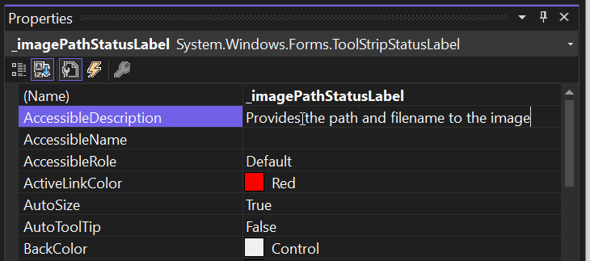
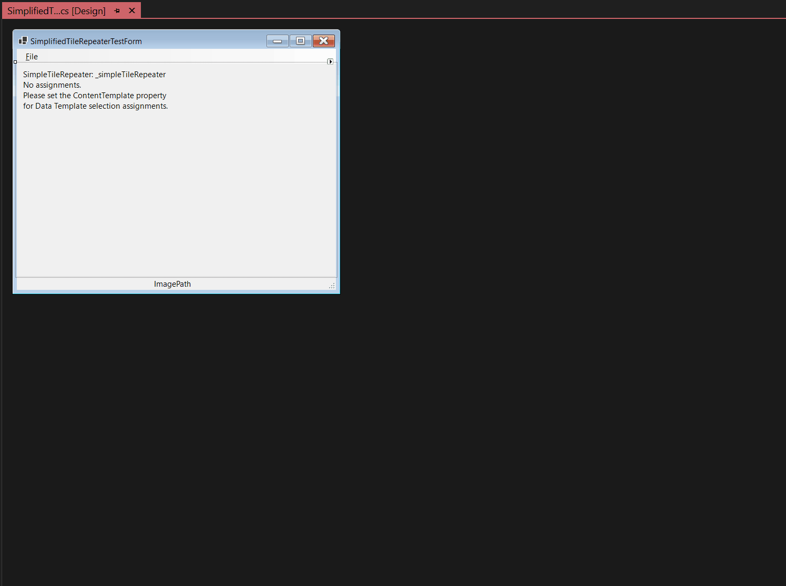
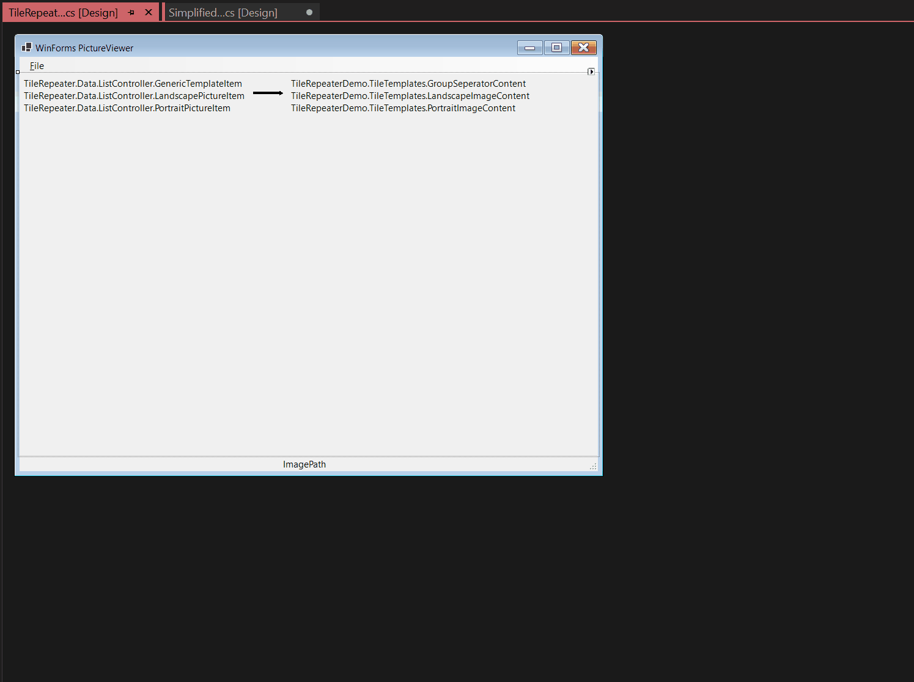
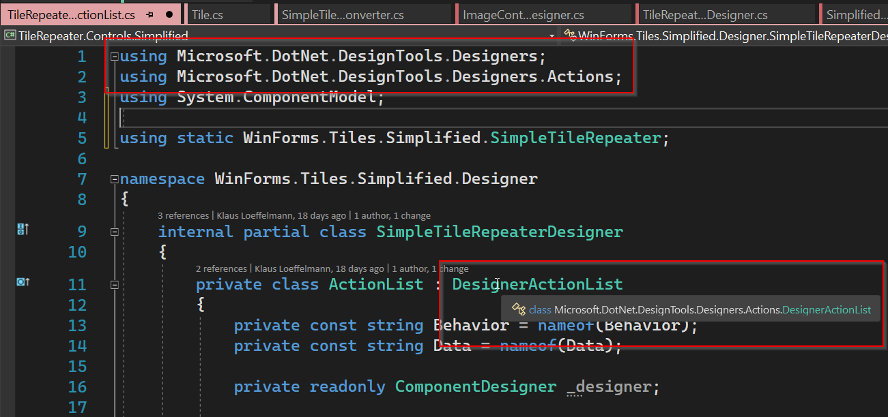

# NetControlDesigners - Developing Custom Controls for the new WinForms Designer

The new Windows Forms (WinForms) .NET Designer needs a new SDK for authoring
Custom ControlDesigners. The necessary migration of Custom ControlDesigners from
.NET Framework to .NET is straight forward. Only UI-intensive design time
experience, such as custom dialogs requires custom code. This blog post shows,
what work is necessary to migrate WinForms ControlDesigners from .NET Framework
designer model to .NET designer model.

## The Demo scenario – the WinForms TileRepeater Control

If you ever developed in WPF, then you probably like, and in WinForms, miss a
feature, which is really useful in list binding scenarios: `DataTemplates` and
`DataTemplateSelectors`. Imagine, you have a list of elements as a data
source, each deriving from the same base type. For example, an
`ImageItem`, which holds a path to an image on disk. And from those you derive
an `PortraitImageItem` and a `LandscapeImageItem`. Now, you bind this list
to a List control, which will pick as the renderer for each item a WinForms
user control based on the type of the item you want to bind. In the sample, on
binding this control will instantiate a respective user control for showing
images in portrait format, and user controls for showing images in landscape
format. By choosing the right inheritance hierarchy, even introducing a
Separator item for grouping those user controls, for example
by months, is easily possible.

This is, what this sample is about. And using this control at runtime looks like
this:


**DISCLAIMER**: The control is a demo for the specific .NET WinForms Designer
scenario. It is not something that we suggest to use in a real-live scenario.
For example, it lacks a virtual rendering mode, so, it uses up a Window Handle
for every element it shows. It works fine for up to 500 elements, but more than that drains the available resources too much, and a virtual mode would be necessary to show a large number of items reliably. But by all
means: It's a good start point for getting engaged, and this control has
certainly the potential to be extended in all different directions!

## The challenge

For making the `TileRepeater` control work at design time in a useful way, we
need to implement proper WinForms Designer support. Especially for this control:
with the new .NET Designer which requires  separate processes for the Visual
Studio .NET Framework client-based UI functionality on the one and the actual
.NET Forms and Control instantiation, management and rendering in a dedicated
Server process on the other side, authoring ControlDesigners has become a bit
tricky, when at least one of the controls needs a dedicated, custom UI. Compared
to the Framework Designer, this is a breaking change when you need to implement
custom .NET type editors, which are responsible the handle this type of UI. And
here is why:

When we want, for the example of this scenario, to show a modal Dialog, which
allows the user to pick the types for the data template selection (so, which
item type of the data source list to bind should result in what UserControl to
render), we have to deal with the different processes: The Visual Studio Process
runs in .NET Framework. But the actual control, which we are showing the custom
UI for, runs in the dedicated .NET server process: If your WinForms project,
which is using the control, is targeting .NET Core 3.1, then that process runs
.NET Core 3.1; if you target 6.0, the Server Process runs against .NET 6.0, and
so on. That is necessary, because you need and use types only the specific
version of .NET, you're targeting your WinForms App against, knows about. The
Visual Studio, .NET Framework-based client process is simply not able to
discover nor handle those newer .NET types. It simply doesn’t know them. From
that fact arises the actual challenge: Since the Control Designer’s dialogs are
also running in the context of .NET Framework, it cannot simply search for the
types (in our example neither both the items to bind and the resulting
UserControl types) it is supposed to offer the user in that dialog. Rather, the
.NET Framework part of the type editor needs to ask the .NET Process for those
types, and then it uses helper transport classes to get those types
cross-process back to the Framework based Visual Studio process. It can now
process the user’s input and send the results back to the server process. And
yes, that’s a change from the previous .NET Framework-only Control Designers,
and it involves indeed some refactoring of the design time code, but _only_ if
there _is_ an actual UI which needs to be shown on top of the UI that is
presented in the context of your actual control. Here is what that means
exactly:

- If you're control requires a UI, which is based on a type-converter and
  therefore shown in the context of the Property grid (like Enums or dedicated
  items to show in a property grid’s property grid cell ComboBox), your UI will
  be supported by the new designer model out of the box.

- If you're control requires a UI, which shows up as part of the control (like
  custom painted adorners or Action Lists) at design time, then you would need
  to write your control library against the WinForms Designer SDK, but you don’t
  need to roundtrip data to the Server process. Everything from the Developer’s
  perspective seems to actually be done server-side, and you can reuse most of
  the existing Control Designer Code. Note though, that you need to target it
  against the Windows Designer SDK.

- If you have custom type editors, however, which are displaying dedicated modal
  dialogs, then there is some rewriting effort involved for round-tripping the
  required data between the two processes.

- If you have type editors which are derived from existing type editors (like
  `ColorEditor` or `FileNameEditor`) for editing certain types of values for
  existing controls in .NET Framework, then you _also_ need the client/server
approach. That said, your control designer solution most probably doesn't need
to have extra communication code to exchange data between the server and the
client process. As long as you do not change the type the original editor is
handling, the Designer should be able to handle the necessary communication
behind the covers. But: That communication is still required to happen, and the
modified (inherited) editor types still need to be run in the context of Visual
Studio - which at this time is either the 32-Bit Framework process (VS 2019) or
the 64-bit Framework process (VS 2022).

- If you however just _use_ the editors (which again need to be provided by the
  client process), a server-only Control Designer suffices. In that case though,
  you need to state the types as strings, and cannot use `typeof` (in C#) or
  `GetType` (in VB). It would look something like this:

```CS
[Editor("System.Windows.Forms.Design.FileNameEditor, System.Design, Version=4.0.0.0, Culture=neutral, PublicKeyToken=b03f5f7f11d50a3a",
        "System.Drawing.Design.UITypeEditor, System.Drawing, Version=4.0.0.0, Culture=neutral, PublicKeyToken=b03f5f7f11d50a3a")]
public string? Filename { get; set; }
```

## What again is a Type Editor?

Strictly speaking, a Type Editor is a mechanism which provides a UI for an end
user to collect one or more data entries for a certain type via some data entry
devices. The simplest one: A string editor for a control's property of type
`string`, whose value is typed in through the keyboard.




- The property grid allows you enter an arbitrary text for a property of type
  string. You type in the text in the editable cell, and then that content gets
  assigned to that string property at design time. The next time you hit the
  save button in Visual Studio, the CodeDOM serializer re-generates the method
  `InitializeComponent` for the document (Form, UserControl) you are editing,
  and with it generate an assignment code line, which assigned the text you just
  types in to that respective property.

- But! Not all properties are of type string. So, for most of the cases, a type
  _converter_ will extend the functionality of the inbuilt string editor by
  providing a mechanism to convert the characters you types to the actual type's
  value. The characters 'T','r','u','e' for example are converted to the value
  `true` for a boolean type. So, if you have a custom type, and there is a way
  to easy convert its value to a string representation and vice versa, then,
  you're good! You cam just provide the type converter, and the whole round trip
  from the property grid in VS (in the Framework process) to the actual object
  in the .NET Server process is just happening behind the covers. You don't even
  need to compile against the SDK NuGets to make this happen. (The sample has an
  implementation of a type converter in the file
  _SimpleTileRepeater.TileContentConverter.cs_.)

- But! Not for all properties is there a meaningful way to convert to its
  native value based on a string. Take DataBinding for example. The value, which
  we need to collect from the user, and which needs to be CodeDom-serialized in
  `InitializeComponent`, makes no sense to convert from a simple string
  representation. (Well, that would work, but then you could code the resulting
  and required line of code by yourself to begin with.)

```CS
  this._imageLoaderComponent.DataBindings.Add(
      new System.Windows.Forms.Binding(
          "ImageFilename", this._genericPictureItemBindingSource, "Filename", true));

```

It's more important here to provide a Type Editor with a rich UI. That type
editor then offers the user options to select from, like the Control's property
to bind to, the data source object, and then of course the property of that
object data source. That editor then returns an object instance, which the
CodeDom-serializer then serialized in a way, that by running the assignment code
it becomes reconstructed into the same object, the type editor originally had
constructed it based on the user's input in the dialog at design time.

## Two sample Versions and the why

We already discussed, that different Controls might need different kind of UIs.
When you use only stock editors,  you just need your Control Designer to provide
custom Adorner painting, Action Lists or custom CodeDOM serializers, a
Server-only version for the Designer will do, and that is pretty much the way,
you developed in .NET Framework. Only if your Control or your Control Library
needs custom UI Type Editors, then you need a Client/Server-solution for your
Control library. That is the reason, the sample app contains two versions of the
control: One Control plus its Designer, which is the somewhat simplified version
of the sample, and which just comes with a custom type converter for assigning
just one `TileContent` user control as the renderer for each item. This one is
called `SimpleTileRepeater`. It just needs its Control Designer code next to the
actual Control’s implementation in one assembly/project, and from the
developer's perspective, everything needed at design times just happens in the
server-process.



The second Control is the actual full blown `TileRepeater` control and has
next to everything the `SimpleTileRepeater` has, but also the UI for the
Collection Editor, which allows the user to make a whole list of `TypeAssignments`.
And then, the UI for doing one of the assignments of that list of course is
again a dedicated Type Editor, which needs to be implemented in the way just
described. These type of control designer UIs require the most work.



## Getting started with your own Control Designers

We already have discussed how different requirements for your Control Designers
will lead to different solutions which you will need to setup for your Control
Library. The easiest way is a Control Library which include one or more control
designers for the controls is the one which doesn't need a dedicated Type
Editor.

### Server-only Control Designer Projects

Here are the necessary steps for a Server-only control library:

- If you have not yet a project for your control library, add a .NET class
  library to your solution, and target at least .NET 3.1.
- Place your custom controls in that project.
- If your controls need more than custom type converters, add the WinForms SDK
  Nuget to the project.

```
	<ItemGroup>
		<PackageReference Include="Microsoft.WinForms.Designer.SDK" 
                      Version="1.1.0-prerelease-preview3.22076.5" />
	</ItemGroup>
```

With this reference you make sure, that the types which control a control's
Designer are not provided by the .NET runtime, but rather by the Visual Studio
.NET _Designer. The SDK does not provide those classes and methods, but rather
just the references to those. Once your Control Designer runs then in the
context of the Visual Studio OOP Designer, its types and methods are used. Here
is one example:



Now, while the runtime (Framework as well as .NET) provides an `ActionList`
implementation, in the context of Visual Studio and the OOP Designer, that
original implementation wouldn't work, since they are designed only for
in-process scenarios. So, the SDK principally reroutes all the relevant types to
the OOP Designer, so that _its_ types can be used rather than those of the
respective Runtimes. With that, the Designer can handle the communication behind
the covers, where it's necessary. So, as for this example: Although it seems
that the action list is rendered in the server process, since its derived type
is defined in a (the) .NET process/assembly, the action list itself is still
shown in the context of Visual Studio: Which in the case of Visual Studio 2022
is the 64-Bit Framework process. All the necessary communication between the
(server-side running) custom ActionList derivative and the client is handled by
the Designer behind the covers.

## To make the sample compile

Please note: To make this demo compile, you need to add the output of the package project, which gets build into the folder,

```dotnetcli
NetControlDesigners\src\TileRepeater\NuGet\BuildOut
```

as a package source:


